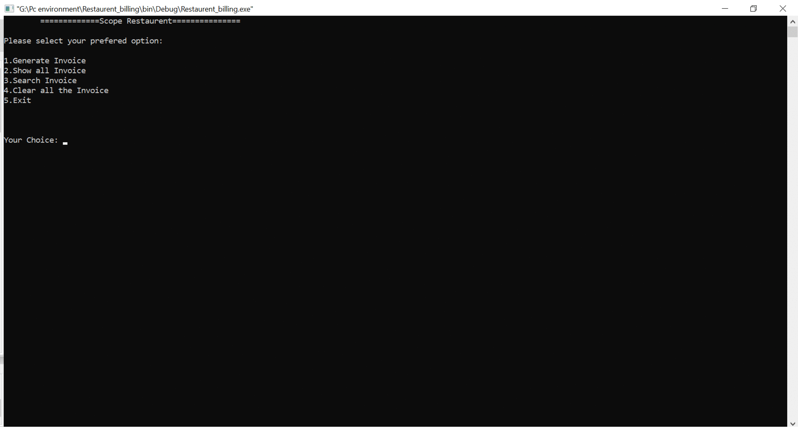

# Bill Helper

It's a bill generator project based on C. Every shop or restaurant sell their product and generate a bill according the product. I make a project where customer name, date, food names all the things are stored in a file and generate a bill or invoice for the customer. Restaurant owner can search invoice for a particular customer invoice or can see all the invoice or clear the file where invoices are stored.

## Working Process 

For making the project I used structure which is a collection of variables under a single name, different type of functions, swtich case for operation selection.

  

